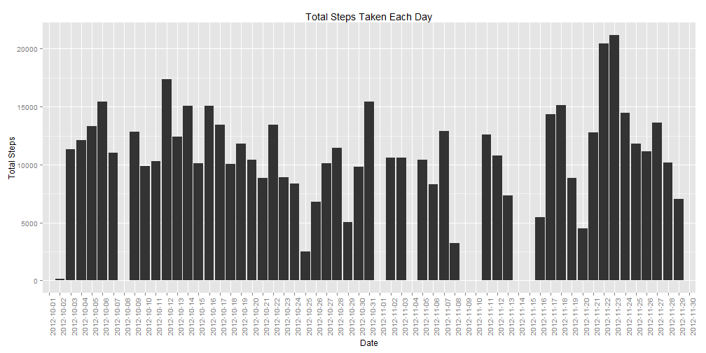
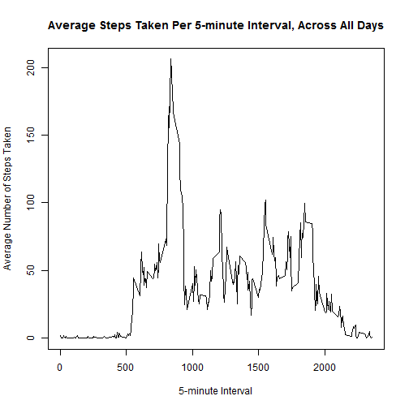
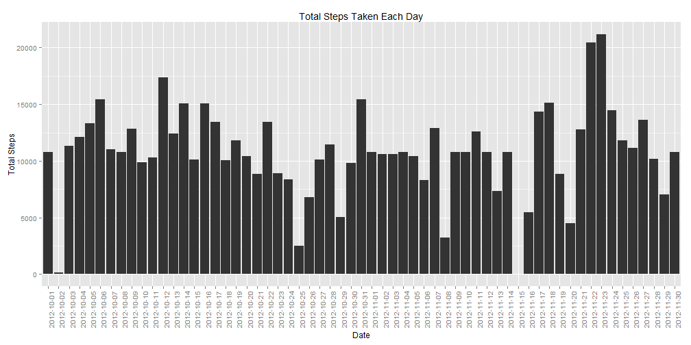
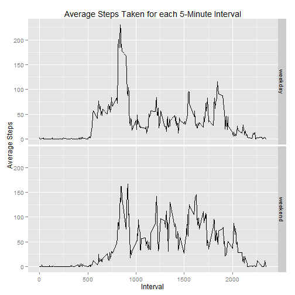

# Reproducible Research: Peer Assessment 1

**Author:** amungi


## Introduction
It is now possible to collect a large amount of data about personal movement using activity monitoring devices such as a Fitbit
(http://www.fitbit.com), Nike Fuelband (http://www.nike.com/us/en_us/c/nikeplus-fuelband), or Jawbone Up (https://jawbone.com/up).

This assignment makes use of data from a personal activity monitoring device. This device collects data at 5 minute intervals through out the day.

The data consists of two months of data from an anonymous individual collected during the months of October and November, 2012 and include the number of steps taken in 5 minute intervals each day.

The Activity Monitoring Data for this assignment has been downloaded from the web site:
https://d396qusza40orc.cloudfront.net/repdata%2Fdata%2Factivity.zip

The variables included in this dataset are:

1. **steps**: Number of steps taking in a 5-minute interval (missing values are coded as NA )

2. **date**: The date on which the measurement was taken in YYYY-MM-DD format

3. **interval**: Identifier for the 5-minute interval in which measurement was taken

The dataset is stored in a comma-separated-value (CSV) file ( named *activity.csv* ) and there are a total of 17,568 observations in this dataset.


## Loading and preprocessing the data

We first load the *activity.csv* file into a data frame *activity_df*. It is assumed that the CSV file is located in the working directory where the code is executed.

We know from the given information that (1) the file contains a header row, (2) missing values are coded as NA, and that (3) *steps* and *interval* values are integers, and *date* values are dates in YYYY-MM-DD format.


```r
activity_df <- read.csv("./activity.csv", header = TRUE, na.strings = "NA", 
                        colClasses = c("integer","Date","integer"))
```

We quickly examine the loaded dataset:


```r
head(activity_df, 20)
```

```
##    steps       date interval
## 1     NA 2012-10-01        0
## 2     NA 2012-10-01        5
## 3     NA 2012-10-01       10
## 4     NA 2012-10-01       15
## 5     NA 2012-10-01       20
## 6     NA 2012-10-01       25
## 7     NA 2012-10-01       30
## 8     NA 2012-10-01       35
## 9     NA 2012-10-01       40
## 10    NA 2012-10-01       45
## 11    NA 2012-10-01       50
## 12    NA 2012-10-01       55
## 13    NA 2012-10-01      100
## 14    NA 2012-10-01      105
## 15    NA 2012-10-01      110
## 16    NA 2012-10-01      115
## 17    NA 2012-10-01      120
## 18    NA 2012-10-01      125
## 19    NA 2012-10-01      130
## 20    NA 2012-10-01      135
```


## What is mean total number of steps taken per day?

For this part of the assignment, we can ignore the missing values in the dataset.

###   Make a histogram of the total number of steps taken each day

We calculate the total number of steps taken each day by using *tapply()* function in R to **sum** the steps for each day, ignoring the missing values *na.rm = TRUE*.


```r
totalstepsperday <- tapply(activity_df$steps, activity_df$date, sum, na.rm = TRUE)
```

The variable *totalstepsperday* obtained above is an array, with the dates as the names of the dimensions, and the total steps per day as the values. Hence we convert this into a data frame *totalstepsperday_df* so that it can be plotted.


```r
totalstepsperday_df <- data.frame(date = names(totalstepsperday), TotalSteps = as.integer(totalstepsperday) )
```

We plot a histogram for the total number of steps taken each day, using the *ggplot2* plotting system.


```r
library(ggplot2)

ggplot(totalstepsperday_df, aes(x=factor(date), y=TotalSteps)) + geom_bar(stat="identity") +
    labs(x = "Date", y = "Total Steps", title = "Total Steps Taken Each Day") +
    theme(axis.text.x = element_text(angle = 90, vjust = 1))
```

 

###   Calculate and report the mean and median total number of steps taken per day

The mean of the total steps taken per day is calculated as follows:


```r
meantotalstepsperday <- mean(totalstepsperday_df$TotalSteps, na.rm = TRUE)
```

The mean is: **9354.2295082 steps per day**


The median of the total steps taken per day is calculated as follows:


```r
mediantotalstepsperday <- median(totalstepsperday_df$TotalSteps, na.rm = TRUE)
```

The median is: **10395 steps per day**


## What is the average daily activity pattern?

This section highlights some of the key aspects of the average daily activity patterns observed in the dataset.


### Make a time series plot (i.e. type = "l" ) of the 5-minute interval (x-axis) and the average number of steps taken, averaged across all days (y-axis)

We calculate the average number of steps taken each day across each 5-minute time interval, by using *tapply()* function in R to calculate the **mean** of the steps for each 5-minute interval, ignoring the missing values *na.rm = TRUE*.


```r
avgstepsperinterval <- tapply(activity_df$steps, activity_df$interval, mean, na.rm = TRUE)
```

The variable *avgstepsperinterval* obtained above is an array, with the intervals as the names of the dimensions, and the average steps per interval as the values. Hence we convert this into a data frame *avgstepsperinterval_df* so that it can be plotted.

The data frame *avgstepsperinterval_df* contains *interval* and *AverageSteps* as variables.


```r
avgstepsperinterval_df <- data.frame(interval = as.integer(names(avgstepsperinterval)), 
                                     AverageSteps = as.numeric(avgstepsperinterval))

head(avgstepsperinterval_df, 20)
```

```
##    interval AverageSteps
## 1         0    1.7169811
## 2         5    0.3396226
## 3        10    0.1320755
## 4        15    0.1509434
## 5        20    0.0754717
## 6        25    2.0943396
## 7        30    0.5283019
## 8        35    0.8679245
## 9        40    0.0000000
## 10       45    1.4716981
## 11       50    0.3018868
## 12       55    0.1320755
## 13      100    0.3207547
## 14      105    0.6792453
## 15      110    0.1509434
## 16      115    0.3396226
## 17      120    0.0000000
## 18      125    1.1132075
## 19      130    1.8301887
## 20      135    0.1698113
```

A time series plot is created, with the 5-minute interval values on the x-axis, and the average number of steps taken, averaged across all days on the y-axis. The base plotting system in R is used for this plot.


```r
with(avgstepsperinterval_df, 
     plot(interval, AverageSteps, type = "l", 
          xlab = "5-minute Interval", ylab = "Average Number of Steps Taken", 
          main = "Average Steps Taken Per 5-minute Interval, Across All Days"))
```

 


### Which 5-minute interval, on average across all the days in the dataset, contains the maximum number of steps?

We use the *filter()* funtion in the *dplyr* library in R to identify the 5-minute interval containing the maximum number of steps on an average, across all the days in the dataset.


```r
library(plyr)
library(dplyr)

maxavgsteps_df <- filter(avgstepsperinterval_df, AverageSteps == max(AverageSteps) )

interval_maxavgsteps <- maxavgsteps_df$interval

maxavgsteps <- maxavgsteps_df$AverageSteps
```


The interval **835** contains the maximum average number of steps **206.1698113** on an average across all the days.


## Imputing missing values

There are a number of days/intervals where there are missing values (coded as NA in the dataset). The presence of missing days may introduce bias into some calculations or summaries of the data.

### Calculate and report the total number of missing values in the dataset 

The original dataset (CSV file) was loaded and stored in the data frame *activity_df*.

We count the total number of rows with missing values (NAs) as follows:


```r
missing_count <- length(which(is.na(activity_df)))
```

The dataset has **2304** missing values.


### Devise a strategy for filling in all of the missing values in the dataset. 

For filling in the missing values in the dataset, we will use the average number of steps taken within each 5-minute interval, averaged across all the days of the dataset. 

This value (mean of steps within a 5-minute interval) is a very representative value when considering any specific 5-minute timeslot on any given day. 

This strategy is better than alternative approaches such as using the mean or median for a given day to determine a missing value, since there may be days on which there are no valid values in the dataset.


### Create a new dataset that is equal to the original dataset but with the missing data filled in.

The original dataset is represented by the data frame *activity_df* and contains missing values.

Based on our strategy of using the average number of steps taken within each 5-minute interval, averaged across all the days of the dataset to fill in the missing values, we can use the data frame *avgstepsperinterval_df* computed earlier.

The data frame *activity_df* contains *steps*, *date* and *interval* as variables, whereas the data frame *avgstepsperinterval_df* contains *interval* and *AverageSteps* as variables.

We merge the two data frames *activity_df* and *avgstepsperinterval_df* into a new data frame *new_df*, based on *interval*.


```r
new_df <- merge(activity_df, avgstepsperinterval_df, by = "interval")
```

This new data frame *new_df* contains the variables *interval*, *date*, *steps* (original variable containing missing values) and *AverageSteps* (average steps taken within each 5-minute interval).


```r
head(new_df, 20)
```

```
##    interval steps       date AverageSteps
## 1         0    NA 2012-10-01     1.716981
## 2         0     0 2012-11-23     1.716981
## 3         0     0 2012-10-28     1.716981
## 4         0     0 2012-11-06     1.716981
## 5         0     0 2012-11-24     1.716981
## 6         0     0 2012-11-15     1.716981
## 7         0     0 2012-10-20     1.716981
## 8         0     0 2012-11-16     1.716981
## 9         0     0 2012-11-07     1.716981
## 10        0     0 2012-11-25     1.716981
## 11        0    NA 2012-11-04     1.716981
## 12        0     0 2012-11-08     1.716981
## 13        0     0 2012-10-12     1.716981
## 14        0     0 2012-10-30     1.716981
## 15        0     0 2012-11-26     1.716981
## 16        0    47 2012-10-04     1.716981
## 17        0     0 2012-11-27     1.716981
## 18        0     0 2012-10-31     1.716981
## 19        0     0 2012-11-18     1.716981
## 20        0     0 2012-10-05     1.716981
```

We create a new variable *newsteps* which will contain either the original value for *steps* OR the value for *AverageSteps* if the original value for *steps* is missing, for each 5-minute time interval.

We use the *mutate()* function in *dplyr* library to do this:


```r
new_df <- mutate(new_df, newsteps = ifelse(is.na(steps),AverageSteps,steps))
```

The *new_df* data frame now contains:


```r
head(new_df, 20)
```

```
##    interval steps       date AverageSteps  newsteps
## 1         0    NA 2012-10-01     1.716981  1.716981
## 2         0     0 2012-11-23     1.716981  0.000000
## 3         0     0 2012-10-28     1.716981  0.000000
## 4         0     0 2012-11-06     1.716981  0.000000
## 5         0     0 2012-11-24     1.716981  0.000000
## 6         0     0 2012-11-15     1.716981  0.000000
## 7         0     0 2012-10-20     1.716981  0.000000
## 8         0     0 2012-11-16     1.716981  0.000000
## 9         0     0 2012-11-07     1.716981  0.000000
## 10        0     0 2012-11-25     1.716981  0.000000
## 11        0    NA 2012-11-04     1.716981  1.716981
## 12        0     0 2012-11-08     1.716981  0.000000
## 13        0     0 2012-10-12     1.716981  0.000000
## 14        0     0 2012-10-30     1.716981  0.000000
## 15        0     0 2012-11-26     1.716981  0.000000
## 16        0    47 2012-10-04     1.716981 47.000000
## 17        0     0 2012-11-27     1.716981  0.000000
## 18        0     0 2012-10-31     1.716981  0.000000
## 19        0     0 2012-11-18     1.716981  0.000000
## 20        0     0 2012-10-05     1.716981  0.000000
```

Now, our goal is to create a new dataset that is equal to the original dataset but with the missing data filled in.

For this, we define a new data frame *new_activity_df*, and select the *interval*, *date* and *newsteps* variables from *new_df* data frame, dropping the *steps* and *AverageSteps* variables.


```r
new_activity_df <- select(new_df, -steps, -AverageSteps)
```

The *new_activity_df* data frame now contains:


```r
head(new_activity_df, 20)
```

```
##    interval       date  newsteps
## 1         0 2012-10-01  1.716981
## 2         0 2012-11-23  0.000000
## 3         0 2012-10-28  0.000000
## 4         0 2012-11-06  0.000000
## 5         0 2012-11-24  0.000000
## 6         0 2012-11-15  0.000000
## 7         0 2012-10-20  0.000000
## 8         0 2012-11-16  0.000000
## 9         0 2012-11-07  0.000000
## 10        0 2012-11-25  0.000000
## 11        0 2012-11-04  1.716981
## 12        0 2012-11-08  0.000000
## 13        0 2012-10-12  0.000000
## 14        0 2012-10-30  0.000000
## 15        0 2012-11-26  0.000000
## 16        0 2012-10-04 47.000000
## 17        0 2012-11-27  0.000000
## 18        0 2012-10-31  0.000000
## 19        0 2012-11-18  0.000000
## 20        0 2012-10-05  0.000000
```

Next, we rename the *newsteps* variable to *steps* to complete our new dataset.


```r
new_activity_df <- rename(new_activity_df, steps = newsteps)
```

Our new dataset *new_activity_df* is equal to the original dataset *activity_df* but with the missing values filled in using the value for average steps taken within a 5-minute interval.


```r
head(new_activity_df, 20)
```

```
##    interval       date     steps
## 1         0 2012-10-01  1.716981
## 2         0 2012-11-23  0.000000
## 3         0 2012-10-28  0.000000
## 4         0 2012-11-06  0.000000
## 5         0 2012-11-24  0.000000
## 6         0 2012-11-15  0.000000
## 7         0 2012-10-20  0.000000
## 8         0 2012-11-16  0.000000
## 9         0 2012-11-07  0.000000
## 10        0 2012-11-25  0.000000
## 11        0 2012-11-04  1.716981
## 12        0 2012-11-08  0.000000
## 13        0 2012-10-12  0.000000
## 14        0 2012-10-30  0.000000
## 15        0 2012-11-26  0.000000
## 16        0 2012-10-04 47.000000
## 17        0 2012-11-27  0.000000
## 18        0 2012-10-31  0.000000
## 19        0 2012-11-18  0.000000
## 20        0 2012-10-05  0.000000
```

### Make a histogram of the total number of steps taken each day

We calculate the total number of steps taken each day by using *tapply()* function in R to **sum** the steps for each day. There are no missing values in the new dataset, however we specify *na.rm = TRUE* for clarity.


```r
new_totalstepsperday <- tapply(new_activity_df$steps, new_activity_df$date, sum, na.rm = TRUE)
```

The variable *new_totalstepsperday* obtained above is an array, with the dates as the names of the dimensions, and the total steps per day as the values. 

Hence we convert this into a data frame *new_totalstepsperday_df* so that it can be plotted.


```r
new_totalstepsperday_df <- data.frame(date = names(new_totalstepsperday), 
                                      TotalSteps = as.integer(new_totalstepsperday) )

head(new_totalstepsperday_df, 20)
```

```
##          date TotalSteps
## 1  2012-10-01      10766
## 2  2012-10-02        126
## 3  2012-10-03      11352
## 4  2012-10-04      12116
## 5  2012-10-05      13294
## 6  2012-10-06      15420
## 7  2012-10-07      11015
## 8  2012-10-08      10766
## 9  2012-10-09      12811
## 10 2012-10-10       9900
## 11 2012-10-11      10304
## 12 2012-10-12      17382
## 13 2012-10-13      12426
## 14 2012-10-14      15098
## 15 2012-10-15      10139
## 16 2012-10-16      15084
## 17 2012-10-17      13452
## 18 2012-10-18      10056
## 19 2012-10-19      11829
## 20 2012-10-20      10395
```

We plot a histogram for the total number of steps taken each day, using the new dataset and the *ggplot2* plotting system.


```r
library(ggplot2)

ggplot(new_totalstepsperday_df, aes(x=factor(date), y=TotalSteps)) + geom_bar(stat="identity") +
    labs(x = "Date", y = "Total Steps", title = "Total Steps Taken Each Day") +
    theme(axis.text.x = element_text(angle = 90, vjust = 1))
```

 


###   Calculate and report the mean and median total number of steps taken per day

The mean of the total steps taken per day with the new dataset is calculated as follows:


```r
new_meantotalstepsperday <- mean(new_totalstepsperday_df$TotalSteps, na.rm = TRUE)
```

The new mean is: **1.0766164 &times; 10<sup>4</sup> steps per day**


The median of the total steps taken per day with the new dataset is calculated as follows:


```r
new_mediantotalstepsperday <- median(new_totalstepsperday_df$TotalSteps, na.rm = TRUE)
```

The new median is: **10766 steps per day**


### Do these values differ from the estimates from the first part of the assignment? 

Yes. 

The new mean **1.0766164 &times; 10<sup>4</sup> steps per day** is higher than the old mean **9354.2295082 steps per day**.

The new median **10766 steps per day** is higher than the old median **10395 steps per day**.

It is also observed that the new median **10766 steps per day** is equal to the new mean **1.0766164 &times; 10<sup>4</sup> steps per day** (comparing only the integer portions of these values), whereas the old median **10395 steps per day** was higher than the old mean **9354.2295082 steps per day**.


### What is the impact of imputing missing data on the estimates of the total daily number of steps?

Imputing missing data has increased the estimates of the total daily number of steps. 

There were several dates in the original dataset where the values for number of steps were missing for the entire day (i.e. values missing for all the time intervals of a given day / date). The strategy of using the average number of steps taken within each 5-minute interval, averaged across all the days of the dataset, to fill-in the missing values, had a positive impact on the estimates, since the average values of number of steps taken were positive (i.e. zero or higher than zero) in all cases.

The new mean and median of daily number of steps is higher for the new dataset (without missing values) than the mean and median for the original dataset containing missing values.


## Are there differences in activity patterns between weekdays and weekends?

We use the new activity dataset (with the filled-in missing values) for this part.


### Create a new factor variable in the dataset with two levels - "weekday" and "weekend", indicating whether a given date is a weekday or weekend day.


We take our new dataset *new_activity_df* created earlier, and add a new variable *dayweek* using the *mutate()* function. For each of the given dates in the dataset, we use the *weekdays()* function to determine the day corresponding to that date. 

We further use an *ifelse* loop to assign the value **weekend** if the day is Saturday or Sunday, and the value **weekday** for all other days.


```r
new_activity_df <- mutate(new_activity_df, 
                          dayweek = ifelse((weekdays(date) == "Saturday" | weekdays(date) == "Sunday"),
                                        "weekend","weekday"))
```

The new dataset *new_activity_df* now has the *dayweek* variable:


```r
head(new_activity_df, 20)
```

```
##    interval       date     steps dayweek
## 1         0 2012-10-01  1.716981 weekday
## 2         0 2012-11-23  0.000000 weekday
## 3         0 2012-10-28  0.000000 weekend
## 4         0 2012-11-06  0.000000 weekday
## 5         0 2012-11-24  0.000000 weekend
## 6         0 2012-11-15  0.000000 weekday
## 7         0 2012-10-20  0.000000 weekend
## 8         0 2012-11-16  0.000000 weekday
## 9         0 2012-11-07  0.000000 weekday
## 10        0 2012-11-25  0.000000 weekend
## 11        0 2012-11-04  1.716981 weekend
## 12        0 2012-11-08  0.000000 weekday
## 13        0 2012-10-12  0.000000 weekday
## 14        0 2012-10-30  0.000000 weekday
## 15        0 2012-11-26  0.000000 weekday
## 16        0 2012-10-04 47.000000 weekday
## 17        0 2012-11-27  0.000000 weekday
## 18        0 2012-10-31  0.000000 weekday
## 19        0 2012-11-18  0.000000 weekend
## 20        0 2012-10-05  0.000000 weekday
```

### Make a panel plot containing a time series plot (i.e. type = "l" ) of the 5-minute interval (x-axis) and the average number of steps taken, averaged across all weekday days or weekend days (y-axis).

To determine the average number of steps taken, averaged across all weekday days or weekend days, we will reshape our dataset *new_activity_df* before computing the average values. 

We use the *melt()* function in the *reshape2* library in R to melt the *new_activity_df* dataset. ID variables are *dayweek* and *interval*, whereas *steps* is the measure variable.


```r
library(reshape2)

actmelt_df <- melt(new_activity_df,id.vars=c("dayweek","interval"),measure.vars=c("steps"))
```

The melted data *actmelt_df* appears as follows:


```r
head(actmelt_df)
```

```
##   dayweek interval variable    value
## 1 weekday        0    steps 1.716981
## 2 weekday        0    steps 0.000000
## 3 weekend        0    steps 0.000000
## 4 weekday        0    steps 0.000000
## 5 weekend        0    steps 0.000000
## 6 weekday        0    steps 0.000000
```

Next, we use the *dcast()* function to cast the melted data back into a data frame, to calculate for each 5-minute *interval* the average (mean) number of steps taken averaged across all weekday or weekend days. We create two data frames **d1** and **d2** corresponding to the data subsets for *weekday* and *weekend*. Each data frame d1 and d2 contains the variables *interval* and *steps* (mean), and we mutate the data frames to include the *dayweek* variable, which is required when we combine the data in the next step.


```r
d1 <- dcast(actmelt_df, interval ~ variable, mean, subset = .(dayweek == "weekday"))
d1 <- mutate(d1, dayweek = "weekday")

d2 <- dcast(actmelt_df, interval ~ variable, mean, subset = .(dayweek == "weekend"))
d2 <- mutate(d2, dayweek = "weekend")
```

Next, we combine all the rows from the data frames *d1* and *d2* using the *rbind()* function:


```r
dplot_df <- rbind(d1,d2)
```

The data in the new data frame will be used for plotting the time series plot, and appears as follows:


```r
head(dplot_df)
```

```
##   interval      steps dayweek
## 1        0 2.25115304 weekday
## 2        5 0.44528302 weekday
## 3       10 0.17316562 weekday
## 4       15 0.19790356 weekday
## 5       20 0.09895178 weekday
## 6       25 1.59035639 weekday
```

```r
tail(dplot_df)
```

```
##     interval       steps dayweek
## 571     2330  1.38797170 weekend
## 572     2335 11.58726415 weekend
## 573     2340  6.28773585 weekend
## 574     2345  1.70518868 weekend
## 575     2350  0.02830189 weekend
## 576     2355  0.13443396 weekend
```

We have now reshaped our data *dplot_df* into a format that can be directly plotted into a time series plot of the 5-minute interval (on the x-axis) and the average number of steps taken, averaged across all weekday days or weekend days (y-axis).

We use the *ggplot2* plotting system.


```r
ggplot(dplot_df, aes(x=interval, y=steps)) + geom_line() + facet_grid(dayweek ~ .) +
    labs(x = "Interval", y = "Average Steps", title = "Average Steps Taken for each 5-Minute Interval")
```

 

Based on the above plot, there are differences in activity patterns between weekdays and weekends.

All the questions in the assignment are answered. This completes the report.
